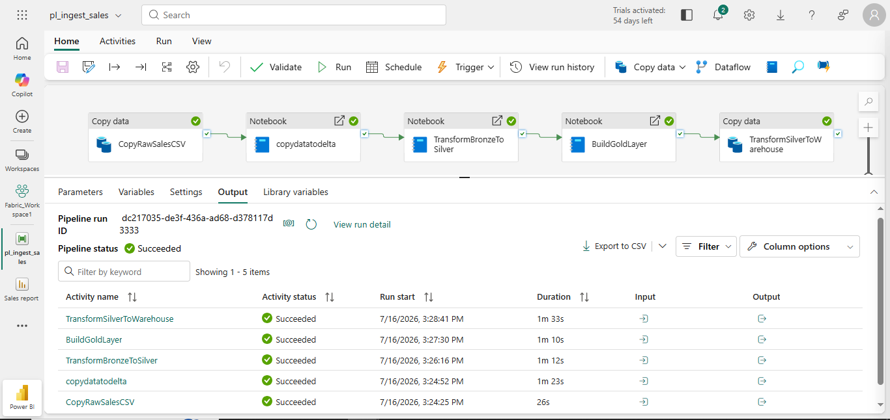
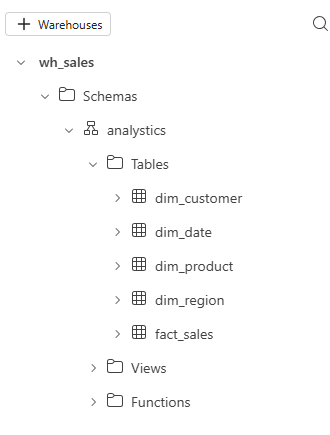
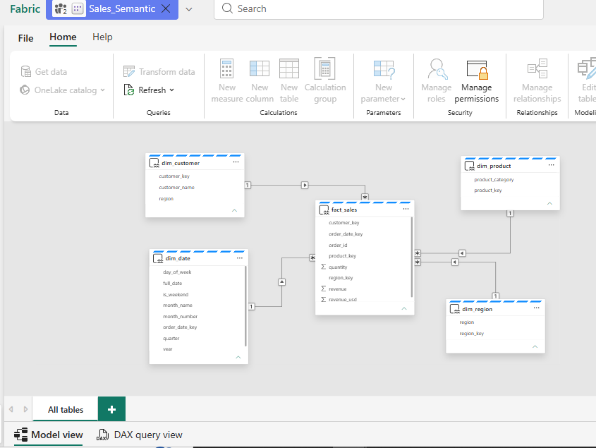
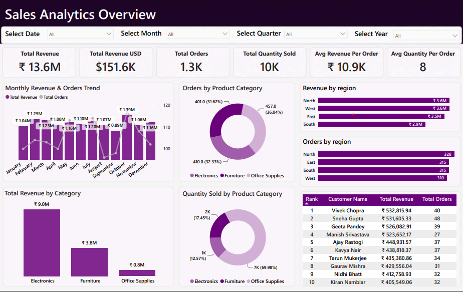

# 📊 Sales Analytics on Microsoft Fabric

End-to-end Sales Analytics project built using **Microsoft Fabric**, implementing the **Medallion Architecture (Bronze → Silver → Gold)** for data engineering and business intelligence. The project demonstrates data ingestion, transformation, dimensional modeling, semantic modeling, and interactive reporting using **Power BI**.

---

## 📌 Project Overview

This project simulates a modern analytics workflow using Microsoft Fabric.

The raw sales dataset is ingested into a Lakehouse, transformed through multiple layers using PySpark notebooks, loaded into a SQL Warehouse, modeled into a star schema, and finally visualized through an interactive Power BI dashboard.

---

# 🏗️ Architecture


The project follows the Medallion Architecture:

- **Bronze Layer** – Raw data ingestion
- **Silver Layer** – Data cleaning and transformation
- **Gold Layer** – Business-ready fact and dimension tables
- **Warehouse** – Analytics storage
- **Semantic Model** – Centralized business logic
- **Power BI** – Interactive reporting

---

# ⚙️ Tech Stack

- Microsoft Fabric
- OneLake
- Lakehouse
- Delta Lake
- PySpark
- Data Pipelines
- SQL Warehouse
- Semantic Model
- Power BI
- DAX

---

# 🔄 ETL Pipeline

The entire workflow is orchestrated using a Microsoft Fabric Data Pipeline.



Pipeline Flow

```
CSV Dataset
      │
      ▼
Copy Data
      │
      ▼
Notebook - Load to Delta
      │
      ▼
Notebook - Bronze → Silver
      │
      ▼
Notebook - Build Gold Layer
      │
      ▼
SQL Warehouse
      │
      ▼
Semantic Model
      │
      ▼
Power BI Dashboard
```

---

# 🥉 Bronze Layer

- Raw sales data ingestion
- Delta table creation
- Historical data preservation
- No transformations applied

---

# 🥈 Silver Layer

Data transformation performed using PySpark.

Transformations include:

- Data cleaning
- Null handling
- Standardized column names
- Derived columns
- Data validation

---

# 🥇 Gold Layer

Business-ready analytical tables were created following a Star Schema.

Fact Table

- fact_sales

Dimension Tables

- dim_customer
- dim_product
- dim_region
- dim_date

---

# 🏢 SQL Warehouse

Gold layer tables are loaded into a Microsoft Fabric SQL Warehouse.



Warehouse Tables

- fact_sales
- dim_customer
- dim_product
- dim_region
- dim_date

---

# ⭐ Semantic Model

Relationships were created using a Star Schema to support efficient reporting.



Model Features

- One-to-many relationships
- Centralized business logic
- DAX measures
- Optimized for Power BI reporting

---

# 📈 Dashboard



The Power BI dashboard includes:

### KPI Cards

- Total Revenue
- Revenue (USD)
- Total Orders
- Total Quantity Sold
- Average Revenue per Order
- Average Quantity per Order

### Visualizations

- Monthly Revenue Trend
- Monthly Orders Trend
- Revenue by Region
- Orders by Region
- Revenue by Product Category
- Quantity by Product Category
- Top Customers
- Interactive Filters

---

# 📁 Repository Structure

```
Sales-Analytics-Fabric
│
├── Dashboard
│   ├── Sales report.pbix
│   └── Sales report.pdf
│
├── Images
│   ├── architecture.png
│   ├── pipeline.png
│   ├── warehouse_tables.png
│   ├── star_schema.png
│   └── dashboard.png
│
├── Notebooks
│   ├── nb_load_to_delta.ipynb
│   ├── nb_transform_broze_to_silver.ipynb
│   ├── nb_build_gold_layer.ipynb
│   └── nb_build_tables.ipynb
│
└── README.md
```

---

# 🚀 Project Workflow

```
CSV Dataset
        │
        ▼
Bronze Layer (Raw)
        │
        ▼
Silver Layer (Cleaned)
        │
        ▼
Gold Layer (Fact + Dimensions)
        │
        ▼
SQL Warehouse
        │
        ▼
Semantic Model
        │
        ▼
Power BI Dashboard
```

---

## 👤 Author

**Chirag Arora**

GitHub: https://github.com/CHIRAGGARORA

---
